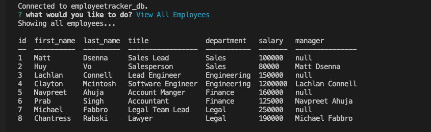
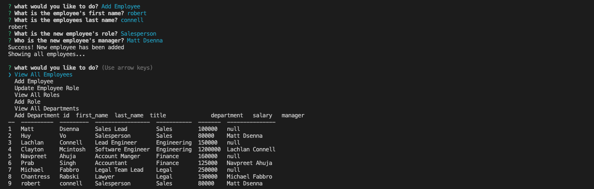
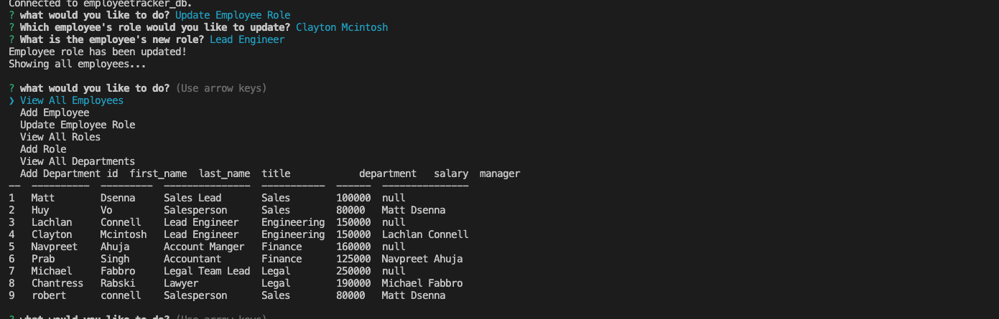
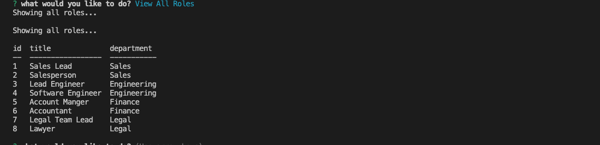
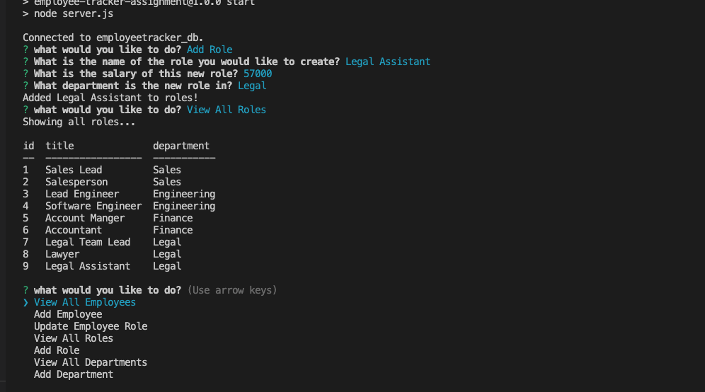
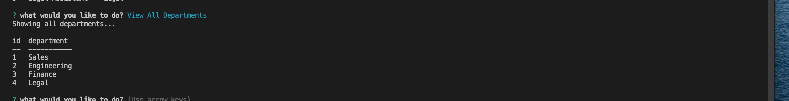
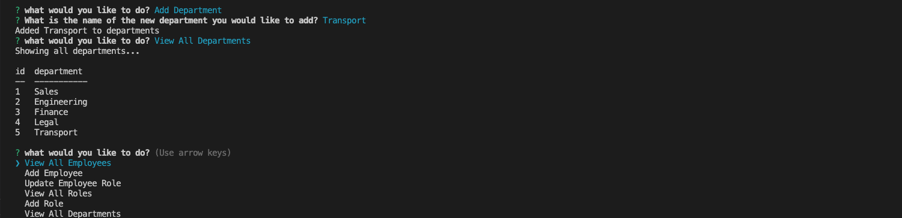

# 12 SQL: Employee Tracker

## The Project

For this project we had to create an employee tracker application. The application is in the style of a CMS (Content Management System), the application was to be built from scratch to manage a company's employee database, using Node.js, inquirer, MYSQL2, and console.table. This application wont be deployed so will also have a walkthrough video to demonstrate its functionality and all of the acceptance criteria being met.

## User Story

```md
AS A business owner
I WANT to be able to view and manage the departments, roles, and employees in my company
SO THAT I can organize and plan my business
```

## Acceptance Criteria

```md
GIVEN a command-line application that accepts user input
WHEN I start the application
THEN I am presented with the following options: view all departments, view all roles, view all employees, add a department, add a role, add an employee, and update an employee role
WHEN I choose to view all departments
THEN I am presented with a formatted table showing department names and department ids
WHEN I choose to view all roles
THEN I am presented with the job title, role id, the department that role belongs to, and the salary for that role
WHEN I choose to view all employees
THEN I am presented with a formatted table showing employee data, including employee ids, first names, last names, job titles, departments, salaries, and managers that the employees report to
WHEN I choose to add a department
THEN I am prompted to enter the name of the department and that department is added to the database
WHEN I choose to add a role
THEN I am prompted to enter the name, salary, and department for the role and that role is added to the database
WHEN I choose to add an employee
THEN I am prompted to enter the employee’s first name, last name, role, and manager, and that employee is added to the database
WHEN I choose to update an employee role
THEN I am prompted to select an employee to update and their new role and this information is updated in the database 
```

## Mock-Up

The following video shows an example of the application being used from the command line:

[](https://2u-20.wistia.com/medias/2lnle7xnpk)

## Some screenshot's of the terminal line


The following image shows the terminal while using the view all employee's function:



The following image shows the terminal while using the add employee function:



The following image shows the terminal while using the update employee role function:



The following image shows the terminal while using the view all roles function:



The following image shows the terminal while using the add role function:



The following image shows the terminal while using the view all departments function:



The following image shows the terminal while using the add department function:



## A link to a video walk through of the demo

This link shows a video of the Employee Tracker in action: https://drive.google.com/file/d/1e7ovNjn6b6-LZjic3Q9NeacXETktLDQP/view